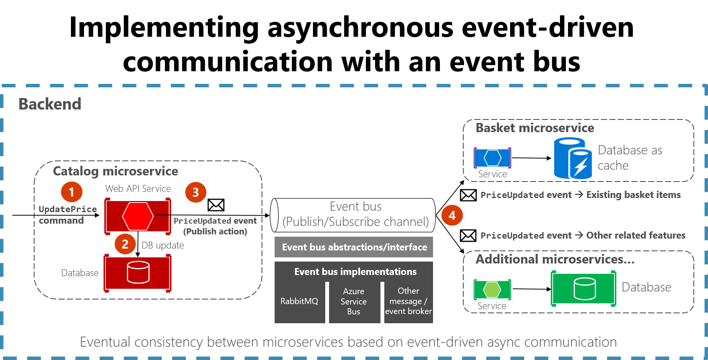

# whisper

Simple implementation of an Event Bus using the Publish/Subscribe pattern. Whisper comes with default implementations for [Google Pub/Sub](https://cloud.google.com/pubsub/docs/overview) and [Redis Pub/Sub](https://redis.io/docs/manual/pubsub/). It also provides a simple interface for implementing your own Pub/Sub for example using [Kafka](https://kafka.apache.org/documentation/).

## Overview

Whisper's event bus allows [publish/subscribe-style](https://en.wikipedia.org/wiki/Publish%E2%80%93subscribe_pattern) communication between your microservices without requiring the components to explicitly be aware of each other, as shown in the following diagram:


> Source: [.NET Microservices](https://docs.microsoft.com/en-us/dotnet/architecture/microservices/)

A trimmed down version of the above diagram is shown below:


> Source: [.NET Microservices](https://docs.microsoft.com/en-us/dotnet/architecture/microservices/)

## Installation

```bash
go get github.com/10hourlabs/whisper
```

## Usage

### Google Pub/Sub

```go
package main

import (
    "context"
    "fmt"
    "log"
    "time"

    "github.com/10hourlabs/whisper"
    "github.com/10hourlabs/whisper/google"
)

type HelloWorldEvent struct {}

type HelloWorldPayload struct {
	CreatedAt int64  `json:"created_at"`
	UpdatedAt int64  `json:"updated_at"`
	Message   string `json:"message"`
}

func (h *HelloWorldEvent) GetContext() context.Context {
	return context.Background()
}

func (h *HelloWorldEvent) GetEventName() event.Event {
	return "hello-world"
}

func (h *HelloWorldEvent) GetSubscriptionID() string {
	return "hello-world-subscription"
}

func (h *HelloWorldEvent) ValidatePayload(payload []byte) error {
	var p HelloWorldPayload
	if err := json.Unmarshal(payload, &p); err != nil {
		return whisper.ErrInvalidPayload
	}
	return nil
}

func (*HelloWorldEvent) Handle(ctx context.Context, body []byte) error {
	var data HelloWorldPayload
	json.Unmarshal(body, &data) // gauranteed to not error
	fmt.Printf("%s\r ", data.Message)
	return nil
}

func main() {
    conf := whisper.NewConfig(context.Background(), "connection-name")
    conf.RegisterEvents([]whisper.EventHandler{
        &HelloWorldEvent{},
    })
    go func() {
        if err := whisper.Listen(whisper.NewGooglePubSub(), conf) ; err != nil {
            log.Fatalf("failed to subscribe: %v", err)
        }       
    }()
    whisper.Wait(time.Second * 5)
}
```
